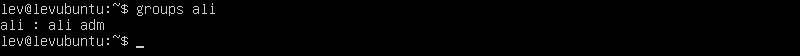
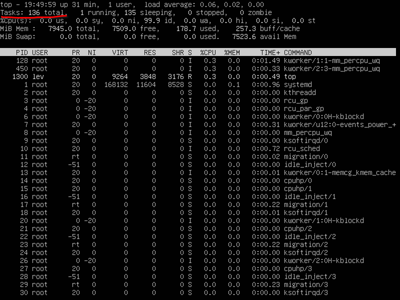

# Linux DO Part 1

## Part 1

- На рисунке ниже показана версия убунту

## Part 2

- На рисунке ниже показаны команды для создания пользователя ali, добавления в группу adm

- На рисунке ниже показан результат команды cat /etc/passwd

- ali добавлен в группу adm:

## Part 3

- Задаем название машины вида user-1: hostnamectl set-hostname user-1
- Рестартим систему: systemctl restart systemd-hostnamed

- Выводим название системы:

- Меняем временную зону:

- Выводим список сетевых интерфейсов:

- lo (loopback device) – виртуальный интерфейс, присутствующий по умолчанию в любом Linux. Он используется для отладки сетевых программ и запуска серверных приложений на локальной машине. С этим интерфейсом всегда связан адрес 127.0.0.1. У него есть dns-имя – localhost. Посмотреть привязку можно в файле /etc/hosts.

- sudo apt install isc-dhcp-server - производим установку DHCP-сервера
- sudo apt install net-tools - для ifconfig
- Используя консольную команду получить ip адрес устройства, на котором вы работаете, от DHCP сервера:

- Dynamic Host Configuration Protocol (DHCP) — это протокол клиент/сервер, который автоматически предоставляет хост Интернет-протокола (IP) с его IP-адресом и другой соответствующей информацией о конфигурации, такой как маска подсети и шлюз по умолчанию.

- Определи и выведи на экран внешний ip-адрес шлюза (ip)

- Внутренний IP-адрес шлюза, он же ip-адрес по умолчанию (gw):

- Задай статичные (заданные вручную, а не полученные от DHCP-сервера) настройки ip, gw, dns (используй публичный DNS-серверы, например 1.1.1.1 или 8.8.8.8).
- sudo nano /etc/netplan/00-installer-config.yaml
- Вот изменения в файле:

- sudo netplan apply

- Результат пингов

## Part 4

- Обнови системные пакеты до последней на момент выполнения задания версии.

- sudo apt update && sudo apt upgrade

## Part 5

- Команда sudo ( substitute user and do, подменить пользователя и выполнить ) позволяет строго определенным пользователям выполнять указанные программы с административными привилегиями без ввода пароля суперпользователя root. Если быть точнее, то команда sudo позволяет выполнять программы от имени любого пользователя, но, если идентификатор или имя этого пользователя не указаны, то предполагается выполнение от имени суперпользователя root. Таким образом, использование sudo позволяет выполнять привилегированные команды обычным пользователям без необходимости ввода пароля суперпользователя root.

- sudo usermod -aG sudo ali
- Скрин с измененным hostname:

## Part 6

- Вывод следующей команды должен содержать NTPSynchronized=yes:
- timedatectl show

## Part 7

- Используя каждый из трех выбранных редакторов, создай файл test_X.txt, где X — название редактора, в котором создан файл. Напиши в нём свой никнейм, закрой файл с сохранением изменений.

- Vim:

- Выход с сохранением:
- :wq

- Nano:

- Выход с сохранением:
- ctrl+x, y

- MCEdit:

- Выход с сохранением:
- f2, f10

- Используя каждый из трех выбранных редакторов, открой файл на редактирование, отредактируй файл, заменив никнейм на строку «21 School 21», закрой файл без сохранения изменений.

- Vim:

- Выход без сохранения:
- :q!

- Nano:

- Выход без сохранения:
- ctrl+x, n

- MCEdit:

- Выход без сохранения:
- f10, No

- Используя каждый из трех выбранных редакторов, отредактируй файл ещё раз (по аналогии с предыдущим пунктом), а затем освой функции поиска по содержимому файла (слово) и замены слова на любое другое.

- Vim (Команды на картинках):

- Nano:
- Поиск: ctrl+w

- Замена: ctrl+\

- MCEdit:
- Поиск: f7

- Замена: f4

## Part 8

- sudo apt install openssh-server

- Добавить автозапуск:

- Перенастрой службу SSHd на порт 2022:
- sudo vim /etc/ssh/sshd_config

- Используя команду ps, покажи наличие процесса sshd. Для этого к команде нужно подобрать ключи.

- ps aux | grep sshd

- Ps позволяет отображать и управлять процессами в операционной системе. Она предоставляет информацию о работающих процессах и позволяет мониторить их состояние.

- ps aux:
- Опция a указывает ps вывести на дисплей процессы всех пользователей, за исключением тех процессов, которые не связаны с терминалом и процессами группы лидеров.
- В u — подставки для ориентированных на пользователя формате, который обеспечивает подробную информацию о процессах.
- Опция x в ps перечисляет процессы без управляющего терминала. В основном это процессы, которые запускаются во время загрузки и работают в фоновом режиме.

- netstat -tan:

-tan:

- t-по протоколу TCP

- a-Отображение всех подключений и ожидающих портов.

- n- Отображение адресов и номеров портов в числовом формате.

- Cтолбцы:

- Recv-Q -количество запросов в очередях на приём на данном узле/компьютере

- Send-Q -количество запросов в очередях на отправку на данном узле/компьютере

- Local Address - адрес и номер локального конца сокета

- Foreign Address - адрес и номер порта удаленного порта сокета

- State - состояние сокета

- Если в качестве адреса отображается 0.0.0.0 , то это означает - "любой адрес", т. е в соединении могут использоваться все IP-адреса существующие на данном компьютере.

## Part 9

- top:
- uptime:

- авторизованные пользователи:

- средняя загрузка:

- Общее кол-во процессов

- загрузку cpu

- загрузку памяти

- pid процесса занимающего больше всего памяти

- shift + m для сортировки по памяти:

- pid процесса, занимающего больше всего процессорного времени
- shift + p для сортировки по процессорному времени

- HTOP:

- Сортировка по:
- pid

- percent_cpu

- percent mem

- time

- Отфильтрованному для процесса sshd

- с процессом syslog, найденным, используя поиск

- clock, hostname, uptime

## Part 10

- Название: ubuntu--vg-ubuntu--lv
- Размер: 10 гб
- Секторы: 20971520
- Swap:

## Part 11

- df:

- На картинке выделена информация о корневом разделе, где:
- размер раздела - 10218772
- размер занятого пространства - 2792984
- размер свободного пространства - 6885116
- процент использования - 29%
- единица измерения - килобайты

- df -Th:

- На картинке выделена информация о корневом разделе, где:
- размер раздела - 9.8G
- размер занятого пространства - 2.7G
- размер свободного пространства - 6.6G
- процент использования - 29%
- Tип файловой системы для раздела-ext4

## Part 12

- Читабельный вывод: du -h

- размер /home: du -h /home

- /var: du -h /var

- /var/log: du -h /var/log

- sudo du -h /var/log/*:

## Part 13

- размер home:

- размер /var:

- /var/log:

## Part 14

- Последняя успешная авторизация:
- grep "Accepted" /var/log/auth.log | tail -n 1

- sudo systemctl restart sshd

## Part 15

- Используя планировщик заданий, запусти команду uptime через каждые 2 минуты:

- Строчки о выполнении:

- Выведи на экран список текущих заданий для CRON:

- Удали все задания из планировщика заданий:
- crontab -r

